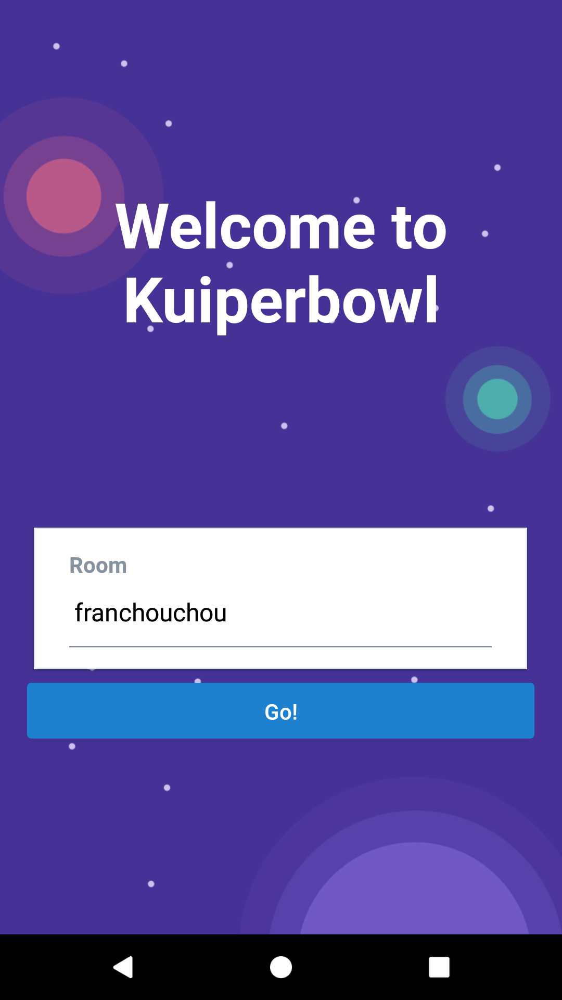
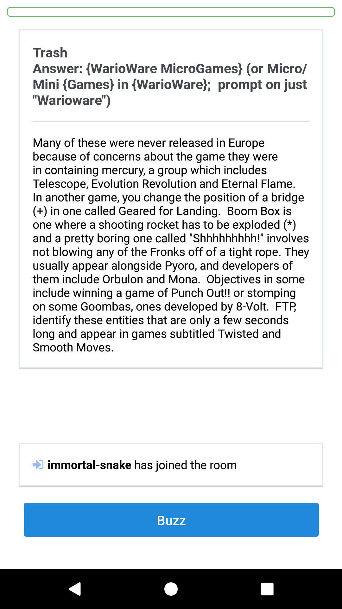

# Kuiperbowl Mobile

Mobile client for Kuiperbowl

 

## Setup and Run

    npm install

    # Android
    # Start emulator or connect device
    npx react-native run-android

    # iOS
    cd ios && pod install
    # Build with XCode legacy build system
